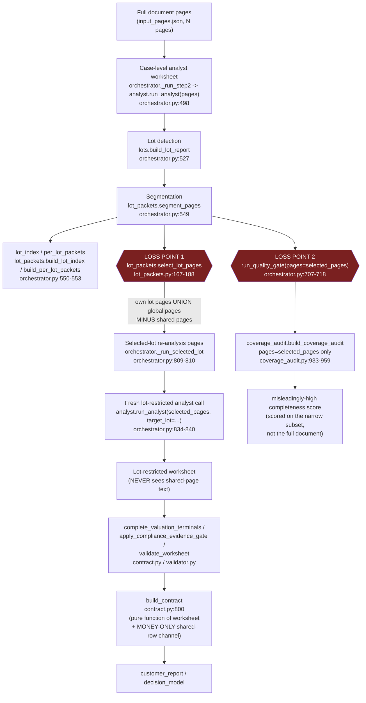

# Lot Fact Projection — Architecture & Remediation Plan

Branch: `feature-correctness-v2-lot-fact-projection`
Base: `main` @ `5c07557`
Audit basis: Fable 5 read-only architecture + forensic-artifact audit (2026-07-22), triggered by
the first external beta test on a real 4-lot judicial-sale appraisal ("the beta multi-lot case").
This document is a **plan only** — no product code was changed while producing it.

Scope guard: this plan does not touch auth, beta membership/quota, credits, Stripe, billing, PDF
retention, frontend visual design, partial-report behavior (lot 4 / blocked-lot handling belongs to
a later branch), model provider/selection, Document AI config, concurrency, GDPR, or session
indexing. No document-specific values (page numbers, € amounts, lot counts, filenames, IDs) from
the beta case are hardcoded anywhere in the design below; they appear only as illustrative numbers
in the forensic trace section, clearly marked as such.

---

## 1. Forensic confirmation (code traced against real job artifacts)

The beta case was a single-lot-per-page-range appraisal with 4 lots and a 31-page document. Its
job artifacts (read-only, under `ops_backups/mauro_beta_investigation_.../job_artifacts/`) were
used to verify every claim below against the exact code that produced them (base SHA `5c07557`,
identical to this working tree).

**Confirmed loss chain for one representative lot** (selected-lot re-analysis job):
- `selected_lot_context.json` shows `analysis_pages` containing only the lot's own pages plus the
  2 global (preamble) pages — a small fraction of the document; `excluded_shared_pages` lists every
  page that named more than one lot (summary tables, the audit/compliance checkbox page, the
  cadastral/formalities pages).
- The **case-level** analyst worksheet (built from the full document) declared, per lot, explicit
  `technical_compliance` entries — e.g. "conforming" for edilizio-urbanistica and catastale, each
  with real evidence pages — plus a lot-specific occupancy detail (a lease-title fact) whose
  evidence pages were also shared/excluded pages.
- The **lot-restricted re-analysis** worksheet (`lots/<lot>/analyst_worksheet.json`), built from
  only the isolated page subset, reclassified every one of those same compliance areas as
  `"uncertain"` with the generic note "the common page says non-conforming/occupied but nothing
  here specifies whether it's about this lot" — because the model was never given the shared pages
  that actually made the specific declaration. The occupancy detail similarly collapsed from a
  specific lease fact to a generic "occupied, no detail available" sentence.
- `customer_report.json` for that job renders these as `status_label: "da verificare"` for
  compliance and a vague occupancy sentence — the specific, previously-known facts are gone from
  what the customer sees.
- `customer_satisfaction_scorecard.json` for the same job reports `overall_score: 98`,
  `completeness: 100`, `status: "CUSTOMER_READY"` — a page-scoped audit run on ~4 of 31 pages,
  scoring the tiny subset as complete.

This matches the mission's diagnosis exactly and the exact code paths are below.

---

## 2. Current pipeline (loss points marked)



### Loss point 1 — shared pages excluded from re-analysis input

- `backend/correctness_v2/lot_packets.py:167-188` — `select_lot_pages()`: `keep = (own | glob) -
  shared`. Docstring at lines 172-176 states the intent explicitly: "Shared multi-lot pages are
  intentionally excluded so a single lot's re-analysis can never absorb another lot's data."
- `backend/correctness_v2/lot_packets.py:740-779` — `build_per_lot_packets()`:
  `analysis_pages = sorted(set(own_pages) | set(global_pages))` (line 745) and the packet's own
  comment (lines 770-772) says explicitly: "we never copy the blended document-level
  occupancy/compliance/formalities into a lot packet."
- `backend/correctness_v2/orchestrator.py:809-810` (`_run_selected_lot`) and the equivalent
  precompute loop at `orchestrator.py:1001-1019` (`_run_analyze_all`) both call
  `lot_packets_mod.select_lot_pages(pages, segmentation, norm_lot)` and feed **only** that subset
  into `analyst_mod.run_analyst(...)` at `orchestrator.py:834-840` / `orchestrator.py:1035-1041`.
- Effect: the model doing the lot-restricted re-analysis literally does not receive the text of
  any shared page. Any compliance/occupancy/formality/surface fact whose only evidence lives on a
  shared page is unknowable to that call and the model correctly (and safely) falls back to
  "uncertain" / generic wording — this is the model behaving correctly given a starved input, not a
  hallucination. The starvation is the bug.
- The **only** existing mitigation is money-only and regex-based:
  `lot_packets.py:300-384` (`project_shared_summary_rows`) scans shared pages for lines with a
  single unambiguous `"LOTTO N"` tag and a €amount, and `contract.py:762-797`
  (`_merge_shared_summary_rows`) merges those rows into the lot's `auction_terms` /
  `valuation_chain`. There is no equivalent channel for compliance, occupancy, legal formalities,
  risk classification, or non-tagged-row money — confirming mission item 4 (see §5).

### Loss point 2 — coverage/quality audit scored on the same narrow subset

- `backend/correctness_v2/orchestrator.py:707-718` (`_build_single_lot_contract`) calls
  `quality_gate_mod.run_quality_gate(pages=pages, worksheet=worksheet, ...)` where, on the
  selected-lot path, `pages` **is** `selected_pages` (passed in from `_run_selected_lot`, itself
  from `orchestrator.py:864` `pages=selected_pages`).
- `backend/correctness_v2/quality_gate.py:58` forwards `pages=pages` unchanged into
  `coverage_mod.build_coverage_audit(...)`.
- `backend/correctness_v2/coverage_audit.py:933-1021` (`build_coverage_audit`) builds its entire
  fact universe from that same `pages` argument: `doc_signals.extract_page_signals(pages)` (line
  959) and `_worksheet_facts(worksheet)` (worksheet is also the lot-restricted one). Every
  "expected fact" the audit could possibly check for is drawn from the ~10% of the document the
  model was given — so a lot fed 4 of 31 pages can score 100% completeness (confirmed empirically,
  §1).
- `backend/correctness_v2/quality_report.py:486-507` (`build_quality_standard_report`) and the
  scorecard builder receive the same narrow `pages` and inherit the same blind spot.
- The identical `pages=selected_pages` limitation applies to `validator.validate_worksheet` and
  `validator.apply_compliance_evidence_gate` (called from `_build_single_lot_contract` at
  `orchestrator.py:649-660`, and inline in `_run_analyze_all` at `orchestrator.py:1099-1108`) — see
  §4 for why this is not just a coverage-audit problem but a **hard blocker** for any naive fix.

### Report-builder assumption (mission item 4)

`backend/correctness_v2/contract.py:800-846` (`build_contract`) is a pure function of `worksheet`
plus two narrow, deterministic, already-verified-text channels: `shared_summary_rows` (money only,
regex-tagged) and `surface_cadastral` (from `doc_signals.extract_surface_cadastral(pages)`, also
page-scoped to whatever `pages` the caller passes). Every other section —
`_executive_summary_facts` (contract.py:107-133), `_risk_cards` (136-193), `_occupancy_view`
(648-659), `_compliance_overview` (662-682), `_legal_formalities_view` (706-719),
`_buyer_action_checklist` (603-645) — reads **only** `worksheet["..."]`. There is no parameter, no
merge function, and no schema slot for a projected **non-money** case-level fact. This confirms the
mission's framing precisely: the report builder today literally cannot accept anything but money
rows from outside the lot-restricted worksheet.

### A structural trap for any naive fix

`backend/correctness_v2/validator.py:819-853` (`validate_worksheet`) computes
`valid_pages = set(page_index.keys())` **from the same `pages` argument** the caller passes, and
`_check_evidence_pages_exist` (validator.py:224-249) raises `UNSUPPORTED_EVIDENCE_PAGE` for any
`evidence_pages` entry outside `valid_pages`. `apply_compliance_evidence_gate` (validator.py:727-813)
similarly builds its `page_index` only from the `pages` it receives and downgrades any `conforming`
claim whose cited text it cannot find (validator.py:762-772).

**Consequence:** if a fix simply copies case-level compliance/occupancy/formality items (with their
real, shared-page evidence_pages) into the lot-restricted worksheet *without also widening the
`pages` argument given to these two functions*, the very next deterministic step will either (a)
fail the whole contract build with `UNSUPPORTED_EVIDENCE_PAGE`, or (b) silently re-downgrade the
injected `"conforming"` claim back to `"uncertain"` because it cannot find matching text at the
pages it was given — reproducing the exact bug the fix was meant to remove. Any implementation of
this plan **must** widen the verification page set alongside the fact projection (§6.B, §6.E).

A second structural trap: `backend/correctness_v2/validator.py:659-683` (`_check_lots`) fails the
whole worksheet (`MULTI_LOT_SELECTION_UNCLEAR` / `LOT_CONTAMINATION`) the moment **any** worksheet
string mentions 2+ distinct lot ids (via `lots.contaminated_worksheet_fields`, which scans
`technical_compliance[].area`, `legal_formalities[].description`, etc. — not just money and
identity). A genuinely case-wide fact whose own original label enumerates every lot (e.g. a
"Titolarità — Lotti 1-2-3-4" declaration) would trip this check the instant it is copied verbatim
into a single lot's worksheet. Any projected item's label/notes must be rewritten to drop other
lots' explicit numeric mentions before merging (§6.B, §7).

---

## 3. Existing data structures carrying case- and lot-level facts

| Structure | Module / function | Shape (key fields) |
|---|---|---|
| Case-level analyst worksheet | `analyst.normalize_worksheet` (analyst.py:428-579), schema `cv2.worksheet.v1` | `case_identity{tribunale,procedura_rge,lotto,address,property_type,ownership_right,evidence_pages}`, `lots[]{lot_id,label,address,property_type,ownership_right,prezzo_base_asta,sale_value,occupancy_status,evidence_pages}`, `occupancy{status,title_info,opponibility,registration_dates,expiry_dates,risks,evidence_pages}`, `technical_compliance[]{area,classification,blocks_saleability,cost,timing,notes,evidence_pages}`, `money{market_value,deductions[],regularization_costs,current_state_value,auction_terms{...},buyer_side_costs[],procedure_cancelled_costs[],uncertain_money[],cancellation_costs,sale_value,evidence_pages}`, `legal_formalities[]{type,description,cancelled_by_procedure,buyer_burden,amount,evidence_pages}`, `risk_classification[]{area,severity,summary,regularizable,evidence_pages}`, `warnings[]`, `missing_or_uncertain[]` |
| Lot-restricted worksheet | Same schema, same module — produced by re-running `run_analyst` on `selected_pages`; saved at `lots/<lot>/analyst_worksheet.json` | Identical shape, scoped content only |
| Lot report | `lots.build_lot_report` (lots.py:184-290), no explicit schema version constant (module-level; consumed structurally) | `multi_lot,lot_count,lot_ids[],lots[]{lot_id,claim_paths[],identifiers[],money[],evidence_pages[]},bene_count,multi_bene,bene_ids[],contaminated_fields[],detection{...}` |
| Segmentation | `lot_packets.segment_pages` (lot_packets.py:79-157) | `page_assignments[]{page,explicit_lots[],assigned_lot,method}`, `lot_pages{lot_id:[pages]}`, `global_pages[]`, `shared_pages[]`, `lot_ids[]` |
| Lot index | `lot_packets.build_lot_index`, schema `cv2.lot_index.v1` | `lots[]{lot_id,lot_number,label,address,property_type,ownership_right,occupancy_summary,money{by_lot fields},key_money[],bene_ids[],page_evidence[],segmentation_pages[],confidence,notes[]}`, `compliance_sections[]{path,area,classification,scope,lot_id,evidence_pages}`, `global_money`, `uncertain_money[]` |
| Per-lot packets | `lot_packets.build_per_lot_packets`, schema `cv2.per_lot_packets.v1` | `packets[]{lot_id,identity{...},bene_ids[],lot_specific_pages[],global_pages[],shared_multi_lot_pages[],reanalysis_input_pages[],lot_money{...},snippets[],lot_specific_detail_requires_analysis:true,uncertainty[]}` |
| Selected-lot context | `lot_packets.build_selected_lot_context`, schema `cv2.selected_lot_context.v1` | `selected_lot_id,analysis_pages[],global_pages[],lot_specific_pages[],excluded_shared_pages[],lot_summary,lot_money,global_money,note` |
| Verified report contract | `contract.build_contract`, schema `cv2.contract.v1` | `lot_summary,case_identity,executive_summary_facts[],risk_cards[],money_table[],valuation_chain[],auction_terms[],buyer_side_costs[],procedure_cancelled_formalities[],uncertain_money[],shared_summary_money[],occupancy{...},compliance_overview[],surface_cadastral[],legal_formalities[],buyer_action_checklist[],evidence_index{page:[claim_paths]},validation_status,uncertainty_flags[]` |
| Customer report | `customer_report.render_success_report`, schema `cv2.customer_report.v1` | `case_identity,lot_structure,executive_summary,key_facts[],risk_sections[],money_sections{valuation_chain,auction_terms,buyer_side_costs,procedure_cancelled_formalities,market_comparatives,context_values,uncertain_money},beni_sections[],buyer_checklist[],occupancy_section{},compliance_section[],formalities_section[],surfaces_section[],manual_review_flags[],evidence sources/index,quality_control{...}` |
| Customer decision model | `decision_model.build_decision_model`, schema `cv2.customer_decision.v1` | `sections{acquisto,numeri,occupazione,conformita,formalita,verifiche,altri,fonti,conferme}`, `findings[]{finding_id,section,topic,title,status,severity,customer_summary,buyer_impact,recommended_action,pages,evidence,confirm_class}`, `esito`, `readiness` |
| Money confirmation | `money_confirmation.build_money_confirmation` | HITL confirmation payload keyed by money `fact_id`/role; consumed back into `coverage_audit`'s `money_confirmations` param |
| Coverage / quality artifacts | `coverage_audit.build_coverage_audit`, `quality_report.build_quality_standard_report/build_customer_satisfaction_scorecard` | `coverage_status,fact_coverage[],critical_omissions[],important_warnings[],useful_background_omissions[],page_coverage[]` / `overall_quality_status,blocking_issues[]` / `overall_score,scores{...},status` |

Adjacent (not part of correctness_v2, out of scope to modify): `perizia_authority_lot_projection.py`
is a feature-flagged shadow-resolver adapter for the **old/legacy** narration pipeline (Phase 3C,
`AUTHORITY_LOT_PROJECTION_ENABLED`), unrelated to correctness_v2 and not imported by it. It is
useful only as an existing precedent for "adapter projects onto an existing report shape without
replacing the schema" — the same philosophy this plan follows, applied to a different system.
`perizia_canonical_pipeline` is unrelated tooling (model-config discovery reused by
`correctness_v2/openai_client.py:129,177`; no fact-projection logic).

---

## 4. Where to add the projection layer with minimal disruption

Because every downstream consumer (`contract.build_contract` → `customer_report.render_success_report`
→ `customer_view.sanitize_customer_report` → `decision_model.build_decision_model`) is a **pure
function of the worksheet/contract/customer_report dicts it is handed**, and none of them re-derive
facts from raw pages except through the two narrow channels above, the lowest-disruption seam is:

> **Insert a new, additive reconciliation step between "lot-restricted analyst worksheet" and
> "`complete_valuation_terminals` / `apply_compliance_evidence_gate` / `validate_worksheet` /
> `build_contract`"**, producing a **reconciled worksheet in the exact same `cv2.worksheet.v1`
> shape** (so contract.py, customer_report.py, decision_model.py, and the seven golden-case tests
> require **zero** changes to consume it), plus a **new, separate, additive artifact**
> (`lot_fact_projection.json`) carrying the full canonical-fact lineage for audit/observability
> only.

This is the "adapter over schema replacement" the mission asks for: nothing downstream of the
worksheet needs to learn a new shape. The two places that *do* need small changes are:
1. The two orchestrator call sites (`_run_selected_lot`, `_run_analyze_all`'s per-lot loop) — insert
   one reconciliation call and widen the `pages` argument passed to the four downstream functions
   that build a `valid_pages`/`page_index` from it (`complete_valuation_terminals`,
   `apply_compliance_evidence_gate`, `validate_worksheet`, `run_quality_gate`/`build_coverage_audit`).
2. `contract.py`'s existing per-item dicts gain a few **additive, optional** provenance keys
   (`projected`, `fact_id`, `applicability`) so the customer-report layer *can* surface "this was
   confirmed from a shared/common section of the document" without requiring it to.

---

## 5. Design

### 5.A Canonical fact lineage (new module `backend/correctness_v2/fact_lineage.py`)

A `CaseFact` is a plain dict (matching the repo's existing style — no ORM/dataclass schemas are
used elsewhere in correctness_v2 for worksheet-shaped data):

```python
{
  "fact_id": str,              # deterministic: f"{category}:{area_token_or_field}:{n}" (stable across reruns of the SAME worksheet)
  "category": str,             # "compliance" | "occupancy" | "formality" | "risk" | "money" | "identity" | "surface_cadastral"
  "field": Optional[str],      # canonical field/area token (contract._area_token style) when applicable
  "label": Optional[str],      # original Italian label/area text, VERBATIM from the case worksheet
  "value": Any,                # classification / status string, or {"amount":..,"role":..} for money
  "source_path": str,          # e.g. "technical_compliance[6]", "occupancy.status", "legal_formalities[2]"
  "source_stage": str,         # "case_worksheet" (today) | "shared_summary_projection" (existing money channel, folded in as one source)
  "evidence_pages": List[int], # VERBATIM from the case worksheet item
  "declaration_status": str,   # "explicit_declaration" | "narrative_summary" | "checkbox_summary" | "derived"
  "evidence_quality": str,     # "specific_statement" | "generic_administrative" | "checkbox_only" | "toc_row"
  "applicability": str,        # CASE_GLOBAL | ALL_LOTS | LOT_SPECIFIC | MULTIPLE_LOTS | BENE_SPECIFIC | UNKNOWN_APPLICABILITY
  "applicability_lot_ids": List[str],   # explicit lot ids this fact is scoped to ([] for CASE_GLOBAL/UNKNOWN)
  "applicability_bene_ids": List[str],  # for BENE_SPECIFIC
  "applicability_basis": str,   # short deterministic reason string, see below
  "confidence": str,            # "high" | "medium" | "low" — deterministic, computed, never model self-reported
  "severity": str,               # reuses doc_signals.SEV_CRITICAL/IMPORTANT/USEFUL/BACKGROUND
  "money": Optional[Dict],       # {"amount": float, "role": doc_signals.ROLE_*} when category == "money"
  "provenance_chain": List[str], # e.g. ["case_worksheet.technical_compliance[6]", "lot_packets.classify_compliance_scope"]
}
```

`build_case_fact_ledger(worksheet, segmentation, lot_report) -> {"schema_version":
"cv2.fact_ledger.v1", "facts": List[CaseFact]}` extracts one `CaseFact` per: `technical_compliance[]`
item, `occupancy` (as a single fact plus one per `risks[]` entry), `legal_formalities[]` item,
`risk_classification[]` item, `case_identity` fields, and the existing money channels
(`money.*`, `worksheet.lots[]` per-lot money, `project_shared_summary_rows` output) — the last of
these is **reused, not reimplemented**: `lot_packets.project_shared_summary_rows` and
`lot_packets.build_lot_money` remain exactly as they are and simply become one `source_stage` inside
the ledger, so the existing, tested money-only regex projection is neither duplicated nor regressed.

**Applicability classification** (generalizes and replaces the narrower
`lot_packets.classify_compliance_scope`, which is kept working for backward compatibility of
`lot_index.compliance_sections` but is reimplemented as a thin wrapper around the new function):

```
_classify_applicability(item_text, evidence_pages, segmentation, known_lot_ids, bene_ids_for_pages) -> (applicability, lot_ids, basis)
```

Deterministic rules, evaluated in order (never an LLM call, never re-reads the model's output):
1. **Explicit enumeration wins first.** If the item's own label/area/description text names one or
   more specific lot ids (`lots.lot_ids_in_text`), that set is authoritative regardless of which
   page it sits on:
   - exactly 1 id → `LOT_SPECIFIC`, `applicability_lot_ids=[that id]`, basis
     `"explicit_lot_reference_in_text"`.
   - 2+ ids that are a **strict subset** of the document's known `lot_ids` → `MULTIPLE_LOTS`, basis
     `"explicit_multi_lot_enumeration"`.
   - 2+ ids that **equal the full known `lot_ids` set** → `ALL_LOTS`, basis
     `"explicit_enumeration_matches_all_known_lots"` (this is the *only* route to `ALL_LOTS` — it is
     never inferred merely from a shared page, per the mission's explicit constraint).
2. **Bene-level reference**, when the text names a bene (`lots.bene_ids_in_text`) and that bene maps
   (via `lot_packets._bene_ids_for_pages`) to exactly one lot → `BENE_SPECIFIC`, scoped to that lot +
   bene, basis `"explicit_bene_reference"`.
3. **Page-position fallback** (only when the text carries no explicit lot/bene reference), using the
   existing `_page_lot_map` / `_assign_lot` machinery in `lot_packets.py`:
   - every evidence page maps to one real lot → `LOT_SPECIFIC`, basis `"single_lot_page_evidence"`.
   - every evidence page is a **global** (preamble, before any lot mention) page → `CASE_GLOBAL` for
     `case_identity`-class facts, `ALL_LOTS` for substantive content facts (compliance / occupancy /
     formality / risk) with basis `"global_page_no_lot_signal"` — a global page with no per-lot
     distinction in its own text is legitimately understood to apply to every lot (this differs from
     rule 1's shared-page case: a *global preamble* page, by construction, precedes any lot-specific
     section and never mixes lot-specific claims).
   - any evidence page is a **shared** (multi-lot-tagged) page and rule 1/2 did not already resolve
     the item → `UNKNOWN_APPLICABILITY`, basis `"shared_page_no_explicit_lot_reference"`. This is the
     rule that directly implements the mission's constraint: a fact merely *sitting* on a shared page
     is never promoted to `ALL_LOTS`.
   - no evidence pages at all → `UNKNOWN_APPLICABILITY`, basis `"no_evidence_pages"`.
4. `declaration_status`/`evidence_quality` are derived from the item's own text via small,
   generic (never document-specific) keyword checks reusing
   `validator._has_positive_compliance_statement` / `_has_negative` style detectors already present
   in `validator.py:127-156` (imported, not reimplemented) plus a check for characteristic checkbox
   phrasing ("□ Sì ■ No" / "Conformità ... Sì/No") to mark `declaration_status="checkbox_summary"`,
   `evidence_quality="checkbox_only"` — this is exactly the shape of the page-4 audit table seen in
   the beta case, generalized to any perizia's summary checklist.
5. `confidence` is computed, never copied from the model: `"high"` for `explicit_declaration` +
   `specific_statement` with 1-2 evidence pages; `"medium"` for `narrative_summary` or 3+ evidence
   pages; `"low"` for `checkbox_summary`/`derived` or `UNKNOWN_APPLICABILITY`.

### 5.B Shared-page / case-fact projection pipeline (new module `backend/correctness_v2/lot_fact_projection.py`)

```python
def project_and_reconcile(
    *,
    case_ledger: Dict[str, Any],        # from fact_lineage.build_case_fact_ledger
    lot_worksheet: Dict[str, Any],       # the lot-restricted re-analysis worksheet (unmodified input)
    lot_id: str,
    segmentation: Dict[str, Any],
    all_lot_ids: List[str],
) -> Tuple[Dict[str, Any], Dict[str, Any]]:
    """Returns (reconciled_worksheet, lot_fact_projection_report).

    reconciled_worksheet has the IDENTICAL cv2.worksheet.v1 shape as lot_worksheet — it is a
    deep copy with additive/filled fields only; contract.py/validator.py/coverage_audit.py need
    no schema awareness of projection at all. lot_worksheet is never mutated.
    """
```

Steps (pure, deterministic, no OpenAI call — this is the direct implementation of "shared pages get
projected without ever re-entering the model", generalizing the existing precedent set by
`project_shared_summary_rows`):

1. **Select applicable facts.** Filter `case_ledger["facts"]` to those whose applicability is
   `CASE_GLOBAL`/`ALL_LOTS` (project into every lot), `LOT_SPECIFIC`/`BENE_SPECIFIC` matching
   `lot_id` (project into this lot only), or `MULTIPLE_LOTS` where `lot_id in
   applicability_lot_ids` (project into this lot only). `UNKNOWN_APPLICABILITY` facts are **never**
   projected as content — they are only surfaced as a low-confidence background note in
   `lot_fact_projection_report["unresolved_case_facts"]` for manual review, never merged into any
   lot's worksheet fields (this is the concrete mechanism preventing cross-lot contamination for
   the ambiguous-shared-page case).
2. **Normalize before merge (`_delotify`).** For every fact selected for projection whose own
   `label`/`area`/`notes` text explicitly enumerates lot ids OTHER than `lot_id` (this happens for
   genuine `ALL_LOTS` facts, e.g. a "Titolarità — Lotti 1-2-3-4" declaration), rewrite the text to
   drop those other lots' explicit numeric mentions before it is merged (e.g. "Titolarità — Lotti
   1-2-3-4" → "Titolarità (dichiarazione comune a tutti i lotti)"). This is required — see §2's
   "structural trap" — so the reconciled worksheet never fails `validator._check_lots`'s
   cross-lot-contamination scan (`lots.contaminated_worksheet_fields`) on a fact that is legitimately
   shared, not contaminated.
3. **Reconcile per category**, one deterministic function per worksheet section
   (`_reconcile_compliance`, `_reconcile_occupancy`, `_reconcile_formalities`,
   `_reconcile_risk_classification`, `_reconcile_case_identity`; money is intentionally **not**
   touched here — the existing `build_lot_money` / `project_shared_summary_rows` /
   `_merge_shared_summary_rows` money-only channel is left as the money reconciliation path and is
   simply cross-referenced by `fact_id` in the projection report for observability), applying the
   rule engine in §5.C.
4. **Attach provenance, additively.** Every worksheet item that was filled or overridden by
   projection gets three new, optional keys appended to its dict: `"projected": true`,
   `"fact_id": "<the CaseFact fact_id>"`, `"projection_reason": "<one of the reason codes in
   §5.C>"`. Existing consumers ignore unknown keys (confirmed: `contract.py`'s `_compliance_overview`
   etc. only read named keys they expect; `customer_view._customer_content` strips only the
   `"classification"` key, nothing else — customer_view.py:442-450 — so these new keys pass through
   safely and are simply not surfaced unless a later UI change wants them).
5. **Emit `lot_fact_projection.json`** (new artifact, schema `cv2.lot_fact_projection.v1`):
   `{"schema_version", "lot_id", "projected_fact_ids": [...], "filled_fields": [{"path", "fact_id",
   "reason"}], "conflicts": [{"path", "lot_value", "case_value", "fact_id", "reason":
   "CONFLICT_REQUIRES_REVIEW"}], "dropped_facts": [{"fact_id", "reason_code", "detail"}],
   "unresolved_case_facts": [{"fact_id", "applicability": "UNKNOWN_APPLICABILITY", "detail"}],
   "verification_pages_added": [int]}`. `verification_pages_added` is exactly the set of extra
   page numbers (beyond `selected_pages`) whose text must be added to the `pages` argument handed to
   `complete_valuation_terminals` / `apply_compliance_evidence_gate` / `validate_worksheet` /
   `run_quality_gate`, computed as the union of `evidence_pages` over every fact actually merged in
   step 3 (never the whole document, never another lot's exclusive pages — only global pages, which
   are already in `selected_pages`, and the specific shared pages whose applicable content was just
   merged).

### 5.C Deterministic reconciliation rules (used by every `_reconcile_*` function in §5.B)

Applied per canonical key (compliance area token, occupancy, formality type+description token, risk
area token):

1. **Exact lot-specific evidence outranks generic case inference.** If the lot-restricted worksheet
   item for this key has non-empty `evidence_pages` that include at least one page **exclusive to
   this lot** (i.e. not a global page) — meaning the model's re-analysis genuinely found its own
   supporting text, not just an empty/global-only fallback — the lot item wins outright; the case
   fact is recorded as `"reason_code": "INVALIDATED_BY_STRONGER_SOURCE"` in `dropped_facts` only if
   it materially disagrees, otherwise it is simply not needed (`DUPLICATE_EQUIVALENT`).
2. **Explicit declarations outrank narrative summaries/checkbox-only text.** When the lot item is a
   generic fallback (`"uncertain"` classification / vague occupancy sentence, evidence pages
   restricted to global pages only, or empty), compare `declaration_status`/`evidence_quality`: a
   case fact with `declaration_status="explicit_declaration"` and `evidence_quality
   ="specific_statement"` overrides the lot item's generic fallback.
3. **A richer, compatible case fact fills a missing lot field; a missing lot value never erases a
   compatible case value.** If the lot item is absent/empty for this key entirely, the applicable
   case fact is inserted verbatim (after `_delotify`, rule 5.B.2).
4. **Material conflicts stay visible, never silently resolved.** If both the lot item and the case
   fact are non-empty, non-generic, and *materially* disagree (different classification enum,
   contradictory occupancy status, contradictory `cancelled_by_procedure`/`buyer_burden` flags) —
   neither is discarded: the (stronger, per rules 1-2) value is kept as the worksheet item so the
   report still renders something, and BOTH values are recorded in
   `lot_fact_projection_report["conflicts"]` with `reason_code: "CONFLICT_REQUIRES_REVIEW"`, which
   the money-confirmation-style HITL surface (§5.D coverage-audit hook) turns into a visible
   manual-review flag — never a silent pick.
5. **Confidence alone never deletes a source-backed material fact.** A `"low"`-confidence case fact
   can still fill a missing lot field (marked with `evidence_quality`/`confidence` in the projection
   report so the coverage audit can weight it, per §5.D); confidence is never, by itself, a reason to
   omit a fact that has real `evidence_pages`. Only the eight named reason codes below justify not
   projecting/keeping a fact:
   `NOT_APPLICABLE_TO_LOT` (applicability excluded this lot), `DUPLICATE_EQUIVALENT` (already present,
   semantically equal), `CONFLICT_REQUIRES_REVIEW` (see rule 4 — the losing variant is still recorded,
   not silently dropped), `SOURCE_EVIDENCE_INSUFFICIENT` (`UNKNOWN_APPLICABILITY` with no usable
   text), `CUSTOMER_SAFETY_SUPPRESSION` (reserved for a future explicit safety rule — unused by this
   branch, kept in the enum for forward-compatibility with the quality-gate's own suppression logic),
   `SCHEMA_UNREPRESENTABLE` (a fact category the worksheet schema has no slot for at all — logged, not
   silently lost, pending a schema extension), `LOW_CONFIDENCE_NONCRITICAL` (a background-severity,
   low-confidence fact deliberately left out of the *rendered* report but still recorded in the
   projection artifact), `INVALIDATED_BY_STRONGER_SOURCE` (rule 1).
6. **No stage downgrades `PRESENT_CORRECT` to `ABSENT` without an explicit reason.** Any time
   reconciliation would remove or weaken a case fact that was `"conforming"`/materially present, the
   function must attach one of the six reason codes above to `dropped_facts` — there is no silent
   path in the implementation that drops a merged item without a recorded reason (enforced by a unit
   test asserting `len(dropped_facts) == 0 or every dropped_facts[i] has a reason_code in the enum`).

### 5.D Full-document lot coverage audit (extends `coverage_audit.py`, additive)

`coverage_audit.build_coverage_audit` gains one new optional keyword, `full_document_pages:
Optional[List[Dict]] = None` (the original, complete `input_pages.json` — the orchestrator already
has this value as `pages` before it ever computes `selected_pages`, so threading it through costs
nothing new). When provided, a new function `_full_document_lot_metrics(lot_id, full_document_pages,
segmentation, case_ledger, reconciled_worksheet, customer_report) -> Dict` is computed and attached
as a new top-level key `coverage_audit["lot_coverage"]` (existing keys unchanged — old readers of
`coverage_audit.json` see everything they saw before):

```
lot_coverage: {
  "lot_id": str,
  "total_document_pages": int,             # len(full_document_pages)
  "selected_pages": [int],                 # unchanged from today
  "selected_page_ratio": float,            # selected / total
  "expected_material_facts": int,          # doc_signals.extract_page_signals(full_document_pages)
                                            #   filtered to this lot's applicability (via case_ledger)
  "expected_critical_facts": int,          # same, severity == SEV_CRITICAL
  "lot_analysis_facts": int,               # facts the lot-restricted re-analysis itself produced
  "projected_facts": int,                  # from lot_fact_projection_report.projected_fact_ids
  "reconciled_facts": int,                 # lot_analysis_facts ∪ projected_facts, deduplicated
  "customer_visible_facts": int,           # facts actually rendered in customer_report sections
  "critical_fact_recall": float,           # customer_visible ∩ expected_critical / expected_critical
  "general_fact_recall": float,            # customer_visible ∩ expected_material / expected_material
  "facts_projected_from_shared_pages": int,
  "facts_dropped_by_reason": {reason_code: count},
  "unresolved_conflicts": int,
  "extraction_coverage_state": "PASS"|"WARNING"|"FAIL",   # thresholds on expected_material_facts vs
                                                            # lot_analysis_facts + projected_facts,
                                                            # NEVER on page counts
  "report_completeness_state": "PASS"|"WARNING"|"FAIL",   # reconciled_facts vs expected_material_facts
  "evidence_completeness_state": "PASS"|"WARNING"|"FAIL",  # fraction of reconciled facts with
                                                            # real (non-empty) evidence_pages
  "user_visible_completeness_state": "PASS"|"WARNING"|"FAIL",  # customer_visible_facts vs
                                                                 # reconciled_facts (catches a
                                                                 # renderer that drops facts the
                                                                 # worksheet/contract already has)
}
```

Thresholds are fact-count ratios (e.g. `critical_fact_recall < 1.0` → `FAIL`,
`general_fact_recall < 0.85` → `WARNING`), never derived from `selected_page_ratio` — a lot given a
small fraction of pages is only informative context (surfaced for admin diagnostics), never itself a
pass/fail signal. This directly prevents the exact regression seen in the beta case: a lot scored
100/98 while being fed 4 of 31 pages would now show `selected_page_ratio ≈ 0.13` alongside
`critical_fact_recall`/`report_completeness_state` computed from the FULL document's expected facts,
not the subset — so the score can no longer be misleadingly perfect merely because the audit only
looked at what the lot happened to receive.

`quality_gate.run_quality_gate` gains the same optional `full_document_pages` kwarg, threaded
straight through to `build_coverage_audit`; `quality_report.build_quality_standard_report` and the
scorecard builder read the new `lot_coverage` block to add (not replace) a "document coverage"
sub-score — existing scoring, thresholds, and the seven golden-case fixtures (which do not pass
`full_document_pages` at all, since they are single-lot synthetic reports) are unaffected because
the parameter defaults to `None` and every new code path is gated on it being present.

### 5.E Deterministic lot-report input contract

The reconciled worksheet (§5.B) already carries this — no new top-level object is needed beyond what
`lot_fact_projection.json` (§5.B.5) plus the existing `selected_lot_context.json` provide together:
selected-lot identity (`selected_lot_context.lot_summary`), Bene identities
(`lot_index.lots[].bene_ids`), selected pages (`selected_lot_context.analysis_pages`), projected
shared facts + conflicts + missing-critical list (`lot_fact_projection.json`), lot re-analysis output
(the reconciled worksheet itself), evidence references (`contract.evidence_index`), coverage metrics
(`coverage_audit.lot_coverage`, §5.D). All of this is structured JSON already — the plan does not add
a new narrative/prompt object; §6 below states the explicit verdict that no prompt change is needed.

### 5.F Minimum observability (new, additive, no PII)

`orchestrator.py`'s per-lot telemetry path (`_emit_status_telemetry`, already PII-free by
construction — see `orchestrator.py:282-340`) gains one new best-effort event payload field set,
emitted alongside the existing `EVENT_REPORT_READY`/`EVENT_VERIFICATION_REQUIRED` events already
fired at `_save_job_status`:
`{"selected_page_ratio": float, "projected_fact_count": int, "reconciled_fact_count": int,
"customer_visible_fact_count": int, "dropped_by_reason": {reason_code: count}, "critical_expected":
int, "critical_present": int, "critical_missing": int, "completeness_state": str}` — all counters and
enum labels, never raw document text, never a fact's `label`/`value`/`notes` string. This mirrors the
existing telemetry contract's shape (`beta_program/signals.py` — untouched) and requires no schema
change to the telemetry sink, only additional numeric/enum fields on the existing event payload.

---

## 6. Prompt-change verdict

**No prompt change is required or recommended for this branch.** The entire fix is a deterministic,
Python-side reconciliation step that runs strictly *after* the lot-restricted analyst call returns
and strictly *before* validation/contract-build. The model's output shape, the worksheet JSON
schema it is asked to produce, and the existing `document_map`-based prompt hint in
`analyst.py:180-222` (`_document_map_text`, used only to keep the model from re-listing other lots
in `lots[]` and tripping `_check_lots`) are all left exactly as they are. Structured, deterministic
projection is strictly sufficient here because:
- every fact this plan recovers already exists, verbatim, in the case-level worksheet the pipeline
  already produces from the full document (§1) — nothing needs to be *re-extracted*, only
  *re-attached* to the right lot(s);
- the applicability decision is answerable from data already on hand (segmentation, explicit lot
  references in text, bene→lot mapping) without any new judgment call requiring a model;
- widening the prompt to describe shared-page content risks reintroducing the very contamination
  risk the isolated-page design was built to prevent (a bigger prompt is a bigger surface for the
  model to blend lots), which the mission explicitly asks to avoid in favor of deterministic
  reconciliation.

If a future case is found where applicability genuinely cannot be determined deterministically (an
`UNKNOWN_APPLICABILITY` case with real evidence and material content), the correct response per this
plan is a manual-review flag (rule 5.C.5, `SOURCE_EVIDENCE_INSUFFICIENT`), not a bigger prompt.

---

## 7. Red-team findings

1. **Cross-lot contamination via verbatim multi-lot labels.** Confirmed structural risk (§2): a
   genuinely `ALL_LOTS` fact whose own text enumerates every lot (e.g. "Lotti 1-2-3-4") would trip
   `validator._check_lots`'s `contaminated_worksheet_fields` scan if merged verbatim into one lot's
   worksheet. Mitigated by mandatory `_delotify` normalization (§5.B.2) before any merge, and by a
   dedicated test (`test_projected_all_lots_fact_does_not_trip_contamination_gate`, §8 matrix item
   12/13).
2. **False certainty via inference-from-shared-page-alone.** The mission's core constraint —
   "do NOT infer ALL_LOTS merely because a fact appears on a shared page" — is enforced structurally:
   `ALL_LOTS` is reachable *only* through rule 1 (explicit full-lot-set enumeration) or rule 3's
   global-page branch (§5.A); a shared page whose content does not explicitly name lots is always
   `UNKNOWN_APPLICABILITY` and is never projected as content into any lot (§5.B.1). This directly
   prevents a scenario worse than today's: instead of silently losing a fact, silently *asserting* it
   for every lot.
3. **Incompatible schema versions (old stored reports vs. new contract).** Because the reconciled
   worksheet, `contract.build_contract`'s output shape, and `customer_report`'s schema are all
   **unchanged** (§4), every artifact produced by a prior job (`analyst_worksheet.json`,
   `verified_report_contract.json`, `customer_report.json` with no `lot_fact_projection.json`
   sibling) continues to load and render exactly as before — `workspace.find_lot_safe_report` and the
   customer-view read paths (`api.py:_read_known_job_artifact`, `_find_customer_job`) do not require
   the new artifact to exist; its absence is simply "no projection metadata available", not a schema
   error. `coverage_audit.build_coverage_audit`'s new `full_document_pages` kwarg defaults to `None`
   and every consumer of `coverage_audit.json` already treats unknown/missing top-level keys as
   absent-just-fine (existing readers index named keys, e.g. `audit.get("coverage_status")`).
4. **Evidence/applicability risk — checkbox-only "conforming".** A page-4-style audit checkbox
   ("Conformità edilizia □ Sì ■ No") is exactly the shape of `declaration_status="checkbox_summary"`,
   `evidence_quality="checkbox_only"` (§5.A step 4) — deliberately given `"low"` confidence and never
   allowed, by itself, to promote a lot's classification to `"conforming"`. It can only ever *confirm
   a negative/uncertain* signal or serve as a last-resort fallback, matching the analyst prompt's own
   existing rule (`analyst.py:80-85`, "NON dedurre MAI 'conforming' dall'assenza di problemi
   segnalati").
5. **Quality-gate interaction.** As detailed in §2/§4, the compliance evidence gate and validator
   would re-downgrade or hard-fail on any projected fact whose evidence lives outside the `pages`
   argument they are given. This is not a hypothetical — it was independently discovered while
   tracing the code (not the original diagnosis) and is treated as a first-class invariant (§9,
   invariant 9) with its own dedicated test (§8 matrix item 3).
6. **Reuse-path interaction.** `orchestrator._find_completed_lot_worksheet` /
   `_build_lot_reuse_fn` (orchestrator.py:913-970) reuse a **prior job's saved
   `lots/<lot>/analyst_worksheet.json`** verbatim, skipping a new OpenAI call. Because projection
   runs *after* the analyst call returns (§4), a reused worksheet is reconciled exactly the same way
   as a freshly-produced one — reuse and projection compose correctly with no special-casing needed,
   and no additional OpenAI call is introduced by turning reuse on.
7. **Money double-counting risk.** Because this plan explicitly leaves `build_lot_money` /
   `project_shared_summary_rows` / `_merge_shared_summary_rows` untouched and does not add a second,
   overlapping money-reconciliation path (§5.B step 3), there is no risk of a shared-page money row
   being merged twice through two different code paths.

---

## 8. Files to change / files to add

### New files
- `backend/correctness_v2/fact_lineage.py` — `CaseFact` shape, `build_case_fact_ledger`,
  `_classify_applicability`, declaration/evidence-quality/confidence helpers (§5.A).
- `backend/correctness_v2/lot_fact_projection.py` — `project_and_reconcile`, `_delotify`, the five
  `_reconcile_*` functions, reason-code constants (§5.B, §5.C).
- `backend/correctness_v2/tests/test_fact_lineage.py` — unit tests for applicability classification
  (all six enum branches) and confidence/evidence-quality derivation.
- `backend/correctness_v2/tests/test_lot_fact_projection.py` — unit tests for the reconciliation
  rules (§5.C), `_delotify`, and the dropped/conflict reason-code invariants.
- `backend/correctness_v2/tests/fixtures/beta_multilot_case_sanitized.json` (+ a matching
  `beta_multilot_case_cached_pages_sanitized.json`) — the eighth sanitized golden fixture (§8 below).
- `backend/correctness_v2/tests/test_beta_multilot_case_regression.py` — the offline replay
  regression using the new fixture (mirrors `test_seven_case_customer_report_regression.py`'s style).

### Modified files (additive changes only, per function below)
- `backend/correctness_v2/coverage_audit.py` — add optional `full_document_pages` kwarg to
  `build_coverage_audit` (§5.D); add `_full_document_lot_metrics`; attach `lot_coverage` key.
  Existing signature keeps working with the new kwarg defaulted to `None`.
- `backend/correctness_v2/quality_gate.py` — thread the same optional `full_document_pages` kwarg
  through `run_quality_gate` into `build_coverage_audit`.
- `backend/correctness_v2/quality_report.py` — read `coverage_audit["lot_coverage"]` when present to
  add a document-coverage sub-score; no change to existing scores/thresholds when absent.
- `backend/correctness_v2/orchestrator.py`:
  - `_run_selected_lot` (orchestrator.py:785-876): after `result = analyst_mod.run_analyst(...)`
    (line 834), call `fact_lineage.build_case_fact_ledger` (built once from the case-level
    `worksheet`/`segmentation` already in scope) and
    `lot_fact_projection.project_and_reconcile(...)`; use the returned reconciled worksheet in place
    of `result.worksheet` for every downstream call in `_build_single_lot_contract`; compute
    `verification_pages = selected_pages + [pages from lot_fact_projection_report
    ["verification_pages_added"]]` and pass `verification_pages` (not `selected_pages`) as the
    `pages` argument to `complete_valuation_terminals`, `apply_compliance_evidence_gate`,
    `validate_worksheet`, and `run_quality_gate` (also pass the original full-document `pages` as the
    new `full_document_pages` kwarg to `run_quality_gate`); save `lot_fact_projection.json` via a new
    `artifacts.save_lot_subartifact(job_id, norm_lot, artifacts.LOT_FACT_PROJECTION_FILE, ...)`.
  - `_run_analyze_all` (orchestrator.py:973-1230ish): identical insertion in the per-lot loop
    (currently lines 1088-1136), same reconciliation call, same `verification_pages` computation, same
    additional artifact save, same `full_document_pages=pages` passed to `run_quality_gate` (line
    1165).
  - `_build_single_lot_contract` (orchestrator.py:620-779): accept the already-widened `pages`
    (verification pages) it is passed — no internal change needed beyond what its callers now supply,
    since it already forwards `pages` verbatim to every downstream function.
- `backend/correctness_v2/artifacts.py` — add `LOT_FACT_PROJECTION_FILE = "lot_fact_projection.json"`
  constant, following the existing naming convention (artifacts.py:36-57); no `save_*` wrapper
  strictly required since `save_lot_subartifact` is generic, but a thin `save_lot_fact_projection`
  wrapper matches the file's existing per-artifact-type convention.
- `backend/correctness_v2/contract.py` — additive only: `_compliance_overview`,
  `_occupancy_view`, `_legal_formalities_view`, `_risk_cards` pass through the new optional
  `projected`/`fact_id`/`projection_reason` keys when present on a worksheet item (a few lines each,
  mirroring how `evidence_pages` is already passed through). No change to `build_contract`'s
  signature or to `_money_sections`/`_merge_shared_summary_rows` (money path untouched, §7 item 7).
- `backend/correctness_v2/lot_packets.py` — `classify_compliance_scope` becomes a thin wrapper
  delegating to `fact_lineage._classify_applicability` for the compliance category only (keeps
  `lot_index.json`'s existing `compliance_sections` shape and the `document_map` narrative text
  byte-identical); `project_shared_summary_rows` / `build_lot_money` / `select_lot_pages` /
  `segment_pages` are **not modified**.
- `backend/correctness_v2/validator.py` — **no signature change**; it already accepts whatever
  `pages` its caller supplies. Documented here only because callers now pass a wider `pages` value
  (verification pages, §above) — this is the load-bearing fix for the "structural trap" in §2/§4.

### Explicitly not touched
`analyst.py` (prompt/schema, §6), `lots.py`, `decision_model.py`, `customer_report.py`,
`customer_view.py`, `money_confirmation.py`, `job_status.py`, `feature_flags.py`, `workspace.py`,
`lot_runner.py`, `pdf_quality.py`, `doc_signals.py` (reused as-is), `perizia_authority_lot_projection.py`,
`perizia_canonical_pipeline/*`, anything under `beta_program/`, `auth_email/`, Stripe/billing code,
frontend.

---

## 9. Invariants (numbered, testable)

1. A fact whose applicability is `ALL_LOTS` appears, after reconciliation, in every lot whose
   `lot_id` is a known document lot — never fewer, never more.
2. A fact whose applicability is `LOT_SPECIFIC`/`BENE_SPECIFIC`/`MULTIPLE_LOTS` never appears in the
   reconciled worksheet of a lot not in its `applicability_lot_ids`.
3. `ALL_LOTS` is only ever assigned via explicit full-lot-set text enumeration or a global (preamble)
   page with no per-lot distinction in its own text — never merely because the source page is
   classified `shared`.
4. A fact with applicability `UNKNOWN_APPLICABILITY` is never merged into any lot's worksheet content
   fields; it may only appear in `lot_fact_projection.json["unresolved_case_facts"]`.
5. Every entry in `dropped_facts` carries one of the eight named reason codes; no code path drops or
   overrides a source-backed material fact silently (no reason string outside the enum).
6. A material conflict (rule 5.C.4) always produces one entry in `conflicts` recording both variants;
   it never resolves to a single value with no record.
7. Confidence level alone is never the sole reason a source-backed fact is absent from
   `dropped_facts["reason_code"] == "LOW_CONFIDENCE_NONCRITICAL"` is the only confidence-driven
   suppression, and it is restricted to `SEV_BACKGROUND`/`SEV_USEFUL` severity facts.
8. `apply_compliance_evidence_gate` and `validate_worksheet`, run on a reconciled worksheet, never
   raise `UNSUPPORTED_EVIDENCE_PAGE` for a fact this plan projected (i.e. `verification_pages` always
   covers every projected fact's `evidence_pages`).
9. A projected `"conforming"` claim's cited text (found within `verification_pages`, not the narrow
   `selected_pages`) satisfies `apply_compliance_evidence_gate`'s positive-statement check — i.e. the
   gate never re-downgrades a fact this plan just recovered.
10. Occupancy is never rendered as a "libero"-equivalent status purely because a specific lease/title
    detail was absent from the lot's own re-analysis; a compatible case-level occupancy detail fills
    the gap (rule 5.C.3) rather than defaulting to an unoccupied/unspecified state.
11. A declared compliance classification (`conforming`/`regularizable`/etc.) with real evidence is
    never rendered to the customer as `"da verificare"` purely because the lot re-analysis pass
    lacked the shared-page text — the reconciliation step (rule 5.C.2) fills it before the gate runs.
12. A forced-sale/judicial-sale value or a depreciation/deduction figure present only on a shared page
    survives into the lot's `money_table` (via the existing, unmodified `build_lot_money` /
    `project_shared_summary_rows` / `_merge_shared_summary_rows` channel) — this plan does not
    regress the money channel while adding the non-money one.
13. Formalities are never assigned wholesale to a lot they do not apply to; a formality item's
    applicability follows the same six-branch classification as any other category (no special-case
    "assign every formality to every lot" shortcut).
14. Every projected/reconciled fact retains real `evidence_pages` inherited from its `CaseFact`;
    `contract.evidence_index` remains fully traceable (no projected fact appears without a page
    citation).
15. `coverage_audit["lot_coverage"]`'s four completeness states are computed from
    `full_document_pages`-derived expectations, never from `selected_page_ratio` directly — a lot fed
    a small page fraction cannot show `report_completeness_state == "PASS"` purely by having nothing
    to compare against.
16. `customer_visible_facts` (user-visible completeness) is tracked and can diverge from
    `reconciled_facts` — a fact present in the reconciled worksheet/contract but dropped by the
    customer-report renderer is visible as a distinct audit signal, not conflated with extraction
    coverage.
17. No PII (tester name/email/company, addresses, cadastral IDs, debtor names) appears in any new
    telemetry field (§5.F) or in `lot_fact_projection.json` beyond what the existing worksheet/
    contract artifacts already legitimately carry (same PII posture as today — this plan adds no new
    PII-bearing field).
18. Replaying a stored job's artifacts through the new reconciliation step (offline test harness, §11)
    consumes no OpenAI credits/quota and performs no production writes — it only reads persisted
    artifacts and calls pure functions.
19. Old stored artifacts (pre-this-branch `analyst_worksheet.json` / `verified_report_contract.json` /
    `customer_report.json` / `coverage_audit.json` with no `lot_fact_projection.json` sibling) load
    and render unchanged; their absence of the new artifact is not treated as an error anywhere in the
    read path.
20. The seven existing golden-case regression tests and the six-case fold referenced in prior branches
    produce byte-for-byte identical `decision_model`/`customer_report` output before and after this
    change (none of them are multi-lot with shared pages, so the reconciliation step is a no-op for
    all of them — verified by running them with the new code and diffing output).

---

## 10. Test plan

### 10.1 Twenty-item generic test matrix

1. Global fact (explicit full-lot-set enumeration or global page) projects to every applicable lot.
2. Shared-page fact tagged to specific lot(s) via explicit text projects only to those lot(s), never
   others.
3. A lot-restricted worksheet's own genuine finding (lot-specific evidence page) is never overwritten
   by a weaker case-level projection (rule 5.C.1) — **and** the validator/compliance-gate accept the
   projected fact's evidence pages without `UNSUPPORTED_EVIDENCE_PAGE` or re-downgrade (this is the
   combined regression test for the "structural trap" in §2/§4).
4. A Bene-specific fact stays scoped to its Bene/lot and never leaks to a sibling lot sharing the same
   document.
5. A case-level fact fills a compatible but missing lot-worksheet field (rule 5.C.3).
6. Lot-specific evidence overrides a weaker generic/case-level inference (rule 5.C.1/5.C.2 ordering).
7. A genuine conflict between lot-specific and case-level facts stays explicit in
   `lot_fact_projection.json["conflicts"]` — never silently resolved.
8. A fact with `UNKNOWN_APPLICABILITY` never contaminates any lot's worksheet content.
9. Occupancy is never converted to a "libero"/unoccupied-equivalent status by omission (invariant 10).
10. A declared compliance status is never converted to `"Da verificare"` purely by shared-page
    exclusion (invariant 11).
11. A forced-sale/judicial-sale value present only via a shared summary row survives into the lot's
    money table (regression on the existing, unmodified money channel).
12. A depreciation/deduction figure present only via a shared summary row survives similarly.
13. Formalities are not misassigned wholesale to every lot; `_delotify` correctly strips other lots'
    explicit numeric mentions from a genuinely `ALL_LOTS` item without changing its meaning.
14. Every projected/reconciled fact is evidence-traceable (`evidence_pages` non-empty,
    `contract.evidence_index` includes its path).
15. Every dropped material fact carries one of the eight reason codes (invariant 5), asserted via an
    exhaustive fixture that forces at least one instance of each reason code.
16. The full-document coverage audit computes expected facts from the whole document, not the
    selected-page subset (direct regression test for Loss Point 2, §2).
17. A lot fed a small selected-page fraction cannot achieve a misleadingly perfect completeness score
    — assert `report_completeness_state`/`critical_fact_recall` are computed against
    `full_document_pages`-derived expectations and correctly reflect a deliberately-starved fixture.
18. Customer-visible coverage (`user_visible_completeness_state`) is measured and reported separately
    from extraction/report/evidence completeness (four independent booleans/states in one fixture
    where they diverge).
19. No PII appears in any new telemetry event field or projection artifact (string-scan assertion over
    the new artifact's serialized JSON against a banned-term list built from the fixture's own
    intentionally-fake PII markers).
20. Replaying a stored job (offline harness, §11) makes zero OpenAI calls (asserted via a caller stub
    that raises if invoked) and zero production/database writes (asserted via a read-only artifacts
    root).

### 10.2 Eighth sanitized golden fixture

New fixture pair alongside the existing Mantova one:
`tests/fixtures/beta_multilot_case_sanitized.json` +
`tests/fixtures/beta_multilot_case_cached_pages_sanitized.json`, following the same "customer_report
already correct in shape, no real document" style used by
`test_seven_case_customer_report_regression.py`'s inline builders. Design:
- 4 lots, entirely synthetic identifiers (`Lotto 1`..`Lotto 4`, fake addresses like "Indirizzo
  omesso 1"), no real tribunale/RGE/names — matching the existing Mantova fixture's sanitization
  convention.
- A realistic page layout: 1-2 global preamble pages, a shared "audit checkbox" page (the
  `checkbox_summary` case, §5.A step 4) whose declarations apply to all 4 lots but phrased
  ambiguously enough to require the applicability classifier (not just page position), a shared
  summary/TOC page with clearly lot-tagged money rows (exercises the existing, unmodified money
  channel), and each lot's own dedicated pages (compliance detail, occupancy detail, valuation).
- One lot (the 4th, mirroring the real beta case) is deliberately built to fail the quality gate
  (a genuinely missing critical fact) — asserting this branch's scope boundary: the fixture asserts
  that lot 4's *valid, already-extracted* case-level facts remain present and retrievable in the case
  ledger / `lot_fact_projection.json` even though its own contract build fails, so a later
  partial-report branch has them available (out-of-scope to *render* here, in-scope to *not
  destroy*).
- Includes at least one deliberately-conflicting fact (one lot's own re-analysis disagrees with a
  case-level projection) to exercise test matrix item 7, and one `UNKNOWN_APPLICABILITY` shared-page
  amount/statement to exercise item 8.
- `beta_multilot_case_cached_pages_sanitized.json` provides the page-text side needed for
  `doc_signals`/`fact_lineage` extraction, entirely synthetic Italian perizia boilerplate (no real
  case's wording reused verbatim — paraphrased/restructured, matching how the Mantova cached-pages
  fixture was already sanitized).

### 10.3 Offline replay harness

`backend/correctness_v2/tests/test_beta_multilot_case_regression.py` drives the pipeline the same way
`test_seven_case_customer_report_regression.py` does: pure in-process calls into
`fact_lineage`/`lot_fact_projection`/`contract`/`customer_report`/`decision_model` over the fixture's
pages/worksheets — **no** `orchestrator.start_job`, **no** network, **no** real OpenAI client (the
one place a "caller" is needed, `analyst.run_analyst`, is exercised only in the narrower
`test_lot_fact_projection.py` unit tests using the existing repo pattern of a `fake_sequence_caller`
already used by `test_shared_summary_projection.py`, never a real API key). No Mongo, no
`artifacts.py` writes to the real jobs directory — fixtures are loaded from the checked-in JSON files
and functions are called directly, mirroring the existing seven-case test's approach of driving
`customer_view.sanitize_customer_report` over an in-memory dict. This guarantees invariant 18/20 (no
credits, no quota, no production writes) structurally, not just by assertion.

---

## 11. Migration / backward compatibility

- **Worksheet schema unchanged** (`cv2.worksheet.v1`) — old stored `analyst_worksheet.json` files
  remain valid inputs to every function that reads them; the only readers that now behave
  differently are the two orchestrator call sites that invoke `project_and_reconcile` on *freshly
  produced* worksheets during a *new* job run. A worksheet artifact already on disk is never
  retroactively rewritten.
- **Contract/customer_report schema unchanged** (`cv2.contract.v1`, `cv2.customer_report.v1`) plus a
  small number of additive, optional per-item keys (`projected`, `fact_id`, `projection_reason`) that
  existing readers (frontend, `decision_model.py`, `customer_view.py`) already tolerate by ignoring
  unknown keys.
- **`coverage_audit.json` schema unchanged** (`cv2.coverage_audit.v1`) plus one new, optional
  top-level key (`lot_coverage`) present only when the (new) caller supplies `full_document_pages`.
  A job run before this branch, or a job run with the kwarg omitted, produces `coverage_audit.json`
  byte-identical to today.
- **New artifact `lot_fact_projection.json`** is additive; its absence (any job run before this
  branch, or any single-lot document where the reconciliation step is a structural no-op) is not an
  error anywhere in the read path (`workspace.py`, `api.py`) — those modules never assume its
  existence.
- **No Mongo schema change.** `mongo/perizia_analysis_full.json`'s `customer_decision_contract` shape
  is produced entirely from `customer_report`/`decision_model`, both schema-stable per above.
- **Reuse path (`CORRECTNESS_V2_LOT_REUSE`)** composes correctly with no changes (§7 item 6).
- **Rollback plan:** since every change is additive/parameter-gated (new optional kwargs defaulting
  to today's behavior, new artifact files, new optional dict keys) and the two orchestrator call
  sites are the only place the new modules are invoked, rollback is a straightforward revert of the
  branch commit(s) with no data migration required in either direction — no existing artifact needs
  rewriting to roll forward, and no artifact produced going forward becomes unreadable if rolled
  back (the new keys/files are simply ignored by the previous code). If a narrower rollback is
  preferred without a full revert, setting a new feature flag (e.g.
  `CORRECTNESS_V2_LOT_FACT_PROJECTION_ENABLED`, defaulting to enabled once shipped, mirroring the
  existing `feature_flags.py` pattern) around the two call sites lets the projection step be disabled
  instantly without touching anything else.

---

## 12. Summary of scope compliance

- No document-specific hardcoding: every rule above (applicability classification, `_delotify`,
  reconciliation priority, coverage thresholds) is generic across lot counts, Bene counts, shared-page
  layouts, and conflict patterns; the sanitized fixture is entirely synthetic.
- No changes to auth, beta/credits/Stripe, PDF retention, frontend visuals, partial-report rendering
  (lot 4/blocked-lot handling stays a later branch's concern — this plan only preserves its valid
  facts, per §10.2), model provider selection, Document AI, concurrency, GDPR, or session indexing.
- Prompt changes: none required (§6, explicit verdict).
- Golden-case regression: unaffected by construction (§9 invariant 20) since none of the seven
  existing cases are multi-lot-with-shared-pages.
